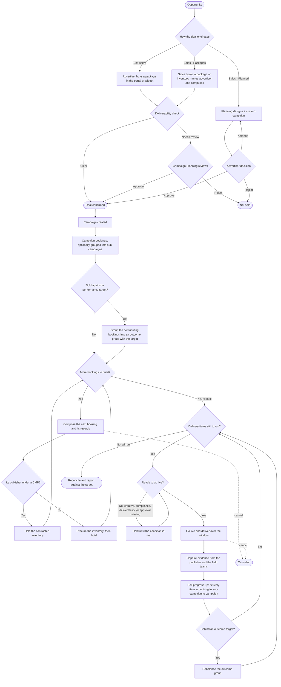
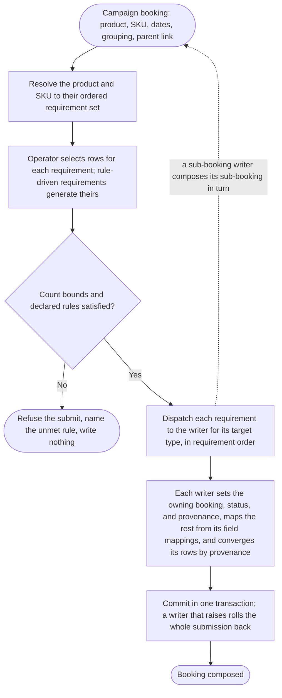
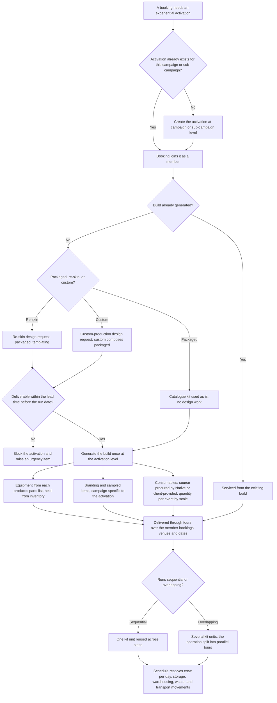
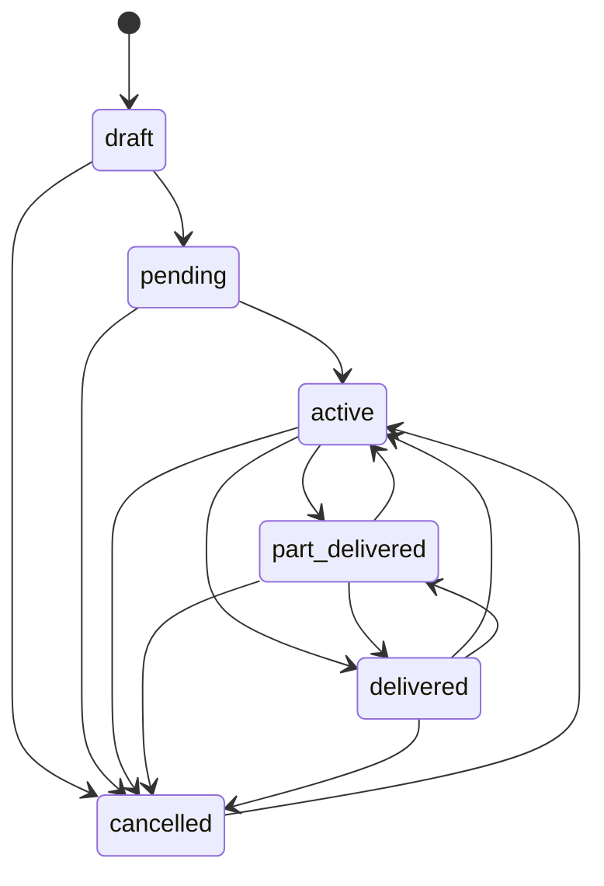

# NMM Operating Model

How the system is organised: the applications and data sources, the campaign lifecycle,
the staff roles, how work is assigned and authorised, the core objects, the
integrations, and the event contract. The final section gives build status.

## 1. Applications and data sources

NMM is four applications. They deploy independently and synchronise through a RabbitMQ
topic exchange. The Delivery API holds the canonical records. Each other application keeps
a projection of them: its own database tables, written and kept current by applying the
`delivery.*` events it receives, and read to serve its own pages. No application reads back
from another at request time.

- **Delivery API.** The backend and the canonical record of campaigns, bookings, and
  delivery. It ingests from CDE and HubSpot, holds the records the other applications
  project, and publishes the `delivery.*` events that synchronise them.
- **Native Media Manager.** The internal application for Native staff. It provides the
  role-based interfaces through which sales, planning, delivery, creative production, and
  the central-services and support roles do their work.
- **SU Media Manager.** The publisher application: evidence, publisher-owned inventory and fairs.
- **Ad Product Portal and Publisher Widget.** The advertiser application: self-serve
  campaigns, briefs, documents, approvals, and the embedded widget through which
  advertisers buy directly.

Two further systems support the applications.

- **Amplify.** Native's operationalised analytics layer (dbt on BigQuery). CDE and the
  other sources feed entirely into it, so the applications read most things through
  Amplify, including the advertiser restriction checks. It holds inventory
  availability, pricing, audience forecasts, and advertiser and campaign history. The
  applications read it and do not own the data.
- **CDE and HubSpot.** The upstream systems of record. CDE holds contracted publisher
  inventory, fairs, institutions, and the advertiser restrictions; HubSpot holds deals
  and line items. CDE feeds the Delivery API two ways. A webhook names each changed
  entity, on which the Delivery API fetches the canonical record and upserts it, so its
  own copy stays current. CDE also feeds Amplify. The applications read what does not need
  to be current through Amplify, including the advertiser restriction checks, and read
  inventory availability, which must be current, from the Delivery API's own copy.
  Reserving inventory is the one write back to CDE.

## 2. Campaign lifecycle

A campaign is created from a confirmed deal and runs until its delivery is complete and
reported. The route from the sale to the first booking is set by how the deal originates:
self-serve, a sales booking of a package or publisher inventory, or a planned custom
campaign. Once the campaign and its bookings exist, the rest of the lifecycle is the same
regardless of that route.

**The deal.** A sale produces a deal in HubSpot, the commercial agreement with the
advertiser. A campaign in NMM is created from a confirmed deal to plan, deliver, and
measure the work; the deal is not the campaign. A deal originates three ways. Self-serve:
the advertiser configures the campaign in the Ad Product Portal or the Publisher Widget,
and on submit a deal is created in HubSpot. Sales - Packages: the sales team books a
package or publisher inventory, names the advertiser and the campuses, and a deliverability
check clears the sale or routes it to campaign planning; the deal is confirmed in HubSpot. Sales -
Planned: planning designs the campaign, builds the proposal and the custom packages, the
advertiser approves them, and the deal is confirmed.

**From deal to campaign.** A confirmed deal becomes a campaign, built in Media Manager. The
advertiser is recorded, the deal is the campaign's commercial reference, and each line item
becomes a campaign booking of its ad product, a fair package, an ad product placement, an
email, social, or insight booking, a packaged experiential, or a campus activation.
Campaigns are built and booked in Media Manager, never in CDE.

**The campaign and its parts.** A campaign holds its bookings. Bookings can be grouped into
sub-campaigns. Each booking delivers through one or more delivery items. Where the campaign
commits to an outcome, the bookings that contribute to a target are grouped into an outcome
group.

**Building a booking.** Composition is one mechanism for every product. The composer resolves
the booking's ad product and SKU to an ordered set of requirements; the operator picks the rows
for each requirement through that requirement's drawer; the submission is validated once, against
each requirement's count bounds and the product's declared rules, before anything is written. Each
requirement is then written by the writer registered for its target type, in requirement order, in
one transaction. There is no per-product branch in the composer: a product differs only in which
requirements its SKU offers and which target type each requirement writes to. The nine target types
are the whole of what composing a booking can produce. Each writer sets only the owning booking, the
status, and the provenance, and reads every other column from the configuration, so it converges its
own rows by provenance: a row whose selection persists is updated, a row whose selection is gone is
cancelled, and a row an operator entered by hand is never touched. A writer that raises rolls the
whole submission back.

Each requirement names one of nine target types, and its writer writes that target and nothing else:

| Target type | What its writer writes |
|---|---|
| `delivery_item` | a `delivery_items` row and the product child the requirement names |
| `operational_fulfilment` | one operational record: equipment, consumables, staffing, transport, storage, waste, permits, insurance, or scheduled work |
| `packaged_experiential_line` | the booking's membership of its campaign or sub-campaign activation; the activation owns the build |
| `production_design_request` | one linked or created design request |
| `sub_booking` | a wrapper's sub-bookings, converged on the parent booking |
| `tour_membership` | the booking's auditable membership of a tour |
| `tour_logistics_plan` | a tour logistics and cost line |
| `tour_capacity_plan` | the split of one large operation into parallel tour instances |
| `generated_review_row` | nothing: the row is computed for the pre-submit summary only |

What a booking generates depends on its ad product:

| Ad product | What building the booking generates |
|---|---|
| Fair package | a fair-space delivery item, and for richer packages bundled email and social sub-bookings |
| DOOH screen or poster site | the placement's delivery item |
| Email | email delivery items, a Native student send or a publisher email slot |
| Social | social delivery items |
| Insight | the insight booking and its measurement work |
| Campus activation, packaged or custom experiential | the booking joins an activation held at campaign or sub-campaign level; the activation's build, equipment, consumables, tour and transport, and one design request per build or re-skin, is generated once and serviced across its member bookings |

Across all of them the booking reserves the inventory it needs, raising procurement where
the publisher is non-exclusive.

**Experiential activations.** Experiential work is not owned by a booking. The central
record is the activation, held at campaign or sub-campaign level: the experiential event
Native runs across campuses over a campaign, a branded stand, a sampling operation, a game,
a photo booth. The experiential project manager creates it, on its own or while raising the
first booking that needs it, and the bookings that deliver it at specific campuses and dates
join it as members; one activation serves many bookings.

An activation is packaged, packaged with a re-skin, or custom. Packaged is a standard
catalogue kit used as it is, with no build. A re-skin takes the advertiser's branding
first, through a re-skin design request with a lead time. Custom is a mostly packaged build
with bespoke elements, through a custom-production design request; custom composes packaged.
The equipment comes from each product's parts list, held from inventory, and the branding
and anything sampled are campaign-specific and belong to the activation, not the catalogue.
Consumables have a source, procured by Native or provided by the client, and a quantity
worked out per event from each event's scale.

The activation is delivered through tours. The tour takes the kit to its stops, the
bookings' venues and dates, and the schedule turns the activation, the bookings, and the
dates into the counts the others do not record: how many kit units, reused when runs are
sequential and several when they overlap, how many crew per day, and the storage,
warehousing, waste, and transport movements.

**Inventory.** CDE is the source of truth for inventory, and it is where a booking's
inventory is reserved; campaigns are not booked in CDE. Exclusive or non-exclusive is the
publisher's contract status: a publisher under a CMP is exclusive, and its inventory is
contracted through CDE; a publisher without one is non-exclusive, and its inventory is
procured per campaign and is the only inventory NMM holds itself. Building a booking
reserves the inventory it needs; the reservation is confirmed when the booking is confirmed
and released if the booking is cancelled.

**Restrictions.** A deliverability check decides whether an advertiser may run on the chosen
campuses. It resolves the advertiser's categories, the jurisdiction, any retained
advertisers a publisher has reserved, and any signed exemptions, to permitted, needs
review, or blocked. Permitted lets the work proceed, needs review holds it for a person to
resolve, and blocked holds it until an override. Sales can run the check before a sale, and
it is checked again before a delivery item goes live.

**Sub-campaigns.** A sub-campaign is an optional grouping of a campaign's bookings through
which the members share and inherit a common set of things: completeness defaults, and,
through the inheritance resolver, the brief, documents, attachments, external links, and
people. A booking belongs to at most one sub-campaign and cannot move across campaigns.
Bookings are grouped this way whenever they should be treated together and inherit shared
configuration; a set delivered as one activation is one common case, not the definition.

**Outcome groups.** An outcome group is not compulsory. It is used when the bookings have
an outcome the advertiser is owed: a target reach, impressions, engagements, or recipients
that Native commits to and must hit. Bookings sold as a fixed deliverable, with no
performance commitment, sit in no outcome group, and a campaign can have several outcome
groups or none. Where one is used, its member bookings deliver toward the target and their
actuals roll up to the group automatically as the delivery records change; because the
commitment is on the group and not on any one booking, an operator can rebalance the group
during delivery, replacing or adding member bookings: the specific bookings the advertiser
receives change, but the outcome they are owed does not.

**Delivery and roll-up.** Delivery happens at the booking and delivery-item level, each
following the workflow set for its type. A delivery item goes live when its work is ready,
its compliance and creative in place and any required approval granted, then it delivers,
and its evidence is captured from the publisher and the field teams. A
required approval is configured for the cases that need one, and the configured approver,
the advertiser, the publisher, or an internal role, grants it; publisher agreement for a
campus activation is one such approval, while a fair's venue is agreed in total at the fair,
not per booking. Progress rolls up the hierarchy: a delivery item advances its booking, a
booking advances its sub-campaign, and the members advance the campaign, so a campaign's
and a sub-campaign's status is derived from their parts rather than set directly. Where an
outcome group has a target, the member actuals roll up to it and the group is rebalanced
if it falls behind. At the end of the delivery window the campaign closes, part delivered
or delivered, and is reconciled and reported against the target.

**Status and inventory.** Each booking and delivery item has a status: draft, pending,
active, part_delivered, delivered, cancelled, advanced by its workflow stages.

A campaign's and a sub-campaign's status is derived from their members, not set directly.

## 3. Roles

The staff roles are a defined set; a user can hold more than one, and permissions are
the union.

**Sales** wins new business. Salespeople browse inventory by availability, campus, and
date, on a list and on a map, with expiring inventory flagged; view and book packages;
and handle deals and enquiries. Two kinds:

- **SMB** books packages for businesses attending a small number of campuses; a package
  is typically one campus. Most sales volume is here, and the packages book automatically
  when the deliverability check clears.
- **Growth** sells larger brands across multiple campuses, with custom packages that
  planning builds.

**Account management** owns the advertiser relationship: the advertiser profile, the
review and approval of advertiser documents, the collection and completion of the
advertiser brief, the routing and chasing of advertiser approvals, advertiser
communications, and account retention and growth.

**Campaign planning and campaign delivery** are one team, two phases.

- Planning builds proposals to win, often well before a deal is close: it checks
  inventory availability and whether a creative concept is feasible, develops the concept,
  procures non-exclusive inventory, builds packages (it owns the Package Builder), and
  after a win enters everything to be booked, including booking by hand the packages
  sales could not book automatically.
- Delivery takes the won campaign to the ROI it was sold on: it sets up the outcome
  groups, checks PLI and risk assessments, ensures creative and collateral arrive in
  time, coordinates with creative production and experiential project management, manages
  delivery costs and chargebacks, and works the queue of what is blocked, due, or at
  risk.

**Creative production** produces the creative and the experiential builds: design
requests, artefact versions, amends rounds, and the custom and packaged build templates.

**Experiential project management** is a central-services role for the complexity of
delivering complex campaigns.

**Logistics and warehousing** is the central-services role for tours, transport, and
warehousing.

**Staffing** runs the brand ambassadors and event staff.

**Tech nexus, engineering, and operational support** are the super-users, who run the
system itself and use the built admin.

Publishers use SU Media Manager and advertisers use the Advertiser Portal, each
projecting the relevant slice of a campaign from the Delivery API's events.

## 4. Work assignment and authorisation

A user's interface presents the work assigned to them and the actions their roles
permit. Three mechanisms produce this.

**Workflow defines the steps.** Every campaign, sub-campaign, booking, delivery item,
campaign plan, and design request runs against a workflow template chosen for its type;
the template's stages are instantiated onto the record. A stage completes only when its
conditions are met (required artefacts present, evidence captured, sign-off pools
signed, fields populated, an approval granted), and completion can fire the record's
next lifecycle transition. Each stage has a deadline and a flag for whether it
blocks completion, which identifies the critical path and what is late.

**Responsibility names the people.** Each record has role slots, the owner and
others, filled by specific users, and a stage can require a sign-off from a named pool.
This is who is accountable for a given record.

**Authorisation sets the capabilities.** A user holds one or more roles, each at a
level, member or lead. The role grants the capabilities (book a package, override an
approval, procure inventory, edit a template, view delivery costs); lead adds the
management capabilities; super-users have an unrestricted bypass. There is no permission
system in the code today; this layer is to be built.

From these, three queues plus the record pages form each interface:

- **My Work**: the open stages on records the user owns or must sign off, ordered by
  deadline and what is blocking.
- **Unassigned**: work that has arrived for the user's role with no owner; members claim
  from it.
- **Team** (leads): the whole team's work and load. A lead assigns or reassigns the
  owner of a record to balance the team and unblock what is stuck. Reassigning moves the
  owner without disturbing the record's stages. v1 is manual assignment plus self-claim;
  automatic distribution by load is later.

A team is the set of users holding a role, and its lead is the lead-level holder. There
is one team per role; multiple teams within a role, such as regional delivery pods each
with its own lead and queue, would need a teams record and are not part of this design.

## 5. Briefs and artefacts

An artefact is any structured document attached to a record: a brief, a proposal, a
creative proof, a compliance certificate. One mechanism serves all of them: a catalogue
of types, a form per type and parent record, versioning, and inheritance that resolves a
value set high on a campaign down to its bookings.

A brief is an artefact. The only differences between briefs are who authors one and who
it directs, so Native needs two.

- **The advertiser brief** is on the campaign and is the intake. Whoever runs intake
  fills it: the advertiser through the portal, a salesperson at booking, or account
  management for a managed account. It scales from a few lines for an SMB package to a
  full structured brief for a Growth campaign, and it resolves down to every booking.
- **The creative brief** is on a design request and directs creative production. It is
  authored internally from the advertiser brief when creative work is commissioned.

A campaign plan needs no brief of its own: it consumes the advertiser brief and produces
a proposal.

## 6. Packages

A package is a single sellable unit priced on ROI: one or more campus activations and
fair packages plus some digital, bundled and sold against an outcome rather than line by
line. It is typically a single campus for SMB and spans several for Growth.

A package is a record: a reusable, priced bundle of the same products a campaign books.
Booking a package runs each of its parts through the booking composer of section 2,
producing the campaign's bookings and their delivery items, activation memberships, and
operational records. The ROI the package is priced on becomes the campaign's outcome
group target.

Planning builds packages in the Package Builder and owns the catalogue. Sales books a
package: when the advertiser and venue restrictions clear the deliverability check it
books automatically; when the check needs review or blocks, it routes to campaign
planning, which verifies and books it by hand. SMB sells from this catalogue, by
self-serve or by a salesperson; Growth packages are custom-built by planning for the
brand. There is no package record in the code today; it is defined here at design level.

## 7. Canonical records

The Delivery API owns the canonical records; the other applications hold projections of
them. A campaign is the advertiser's commercial unit, created from a confirmed deal. Its
campaign bookings are the products bought; each booking delivers through one or more
delivery items, the atomic units of delivery. Sub-campaigns group a campaign's bookings
and hold shared, inherited configuration; outcome groups hold the committed targets and
the actuals measured against them. A campaign plan holds planning's proposal, a design
request commissions creative production, and an approval records a required sign-off. The
experiential activation, held at campaign or sub-campaign level, owns an experiential
build its member bookings share, and the tour, transport, and warehousing records hold
the logistics that deliver it.

Projection is by tenant. Every event includes a tenant field:
a publisher id, an advertiser id, or both, set by the outbox relay from the record. Two things then decide
where a record is projected. The contract's consumer mapping decides which applications
consume an aggregate at all. The tenant field decides which advertiser or publisher,
inside a consuming application, the record belongs to. The Advertiser Portal consumes the
advertiser-facing aggregates (campaign, campaign booking, approval, design request, and
the rest) and writes each event into the projection row keyed by the event's advertiser
id, and shows an advertiser only the records whose advertiser id is theirs. SU Media
Manager consumes the publisher-facing aggregates (the delivery item with its
evidence events, and the publisher's inventory and
fairs) and shows a publisher only the records whose publisher id is theirs. A delivery
item has a publisher id and, through its campaign, an advertiser id, so it is projected to
both applications, scoped to that one publisher and that one advertiser. A record with
neither id is projected to no external application: the internal operational records are
not published to SU Media Manager or the Advertiser Portal, namely the experiential
activation and tour logistics, the transport movements, the workflow assignments, the
dead-letter and reconciliation entries, and the CDE parking record.

## 8. Integrations

**Amplify** provides the analytical data sales and planning use: available
inventory, indicative price, expected reach and performance, and an advertiser's history.
Inventory availability combines Amplify's exclusive (CMP) inventory with the Delivery
API's non-exclusive catalogue. Amplify is read-only and cached; the Delivery API's
events invalidate a cached result when the underlying data changes (a campaign completing, a booking on
a fair, a publisher contact changing).

**CDE and HubSpot** feed the Delivery API upstream, through the translator described in
section 1.

**The event bus** synchronises the three applications. The Delivery API publishes facts;
SU Media Manager and the Advertiser Portal consume the ones they project and act on.
Section 9 sets out the contract.

## 9. Event contract

Every event has the same metadata fields, a predictable routing key, and a payload that
includes enough to rebuild a projection without a callback.

- **Routing keys** are `delivery.<aggregate>.<event>`, for example
  `delivery.campaign_booking.state_changed`. One aggregate per concept, with the parent
  type in the payload rather than split into a routing key per parent.
- **The metadata fields**, the same on every event, are the event id, the type, the
  aggregate type and id, the schema version, the occurred-at and published-at timestamps,
  the publisher, and the tenant (the publisher or advertiser the event concerns). The
  payload follows them. The outbox relay writes all of it.
- **Payloads are complete.** A `created` or `updated` event includes the whole record; a
  `state_changed` event includes the new state, the identifying keys, and the transition
  cause. Each consumer projects whatever subset it needs; the producer does not shape the
  payload to any consumer. No consumer makes a callback to the Delivery API to fill a field.

Events are cross-application or internal. Cross-application events are consumed by SU
Media Manager and the Advertiser Portal to build their projections, and each names its
consumers and what each does on receipt. Internal events are consumed by Native's own interfaces
(the delivery hub, the urgency list, the review queues) and are not published to the
other applications, but still have a defined schema. Dead-letter and reconciliation
entries, the CDE parking record, and the internal operational records (transport
movements, experiential activations, workflow assignments) are internal.

The contract is built against both the events the Delivery API emits now and the events
it will emit once the planned work is built, and it validates strictly: an event with no
schema, or a payload that does not match its schema, fails to publish. The schemas and
the registry that maps each routing key to its schema, publisher, and consumers belong
in a shared contract package, and the outbox, relay, validator, and consumer machinery
in a shared events package. Both are specified in the build plan. The work is to build
them and bring the Delivery API's publishing into line, which today emits unprefixed
keys with payloads each emitting service assembles itself, and no validation.

## 10. Build status

Built today: the Delivery API and its canonical records, the workflow engine and the
shared record features (artefacts, evidence, approvals, people, comments), the outbox
and relay, the CDE and HubSpot translator, and the admin used by super-users.

Specified but not built: SU Media Manager, the Advertiser Portal, the role interfaces
for operational staff, the package record, the role and level authorisation layer, the
shared contract and events packages, and the validated, prefixed event publishing.

Authorities, in order: the running code is confirmed by execution and tests. The
functional spec and build plan are earlier drafts, useful for what they catalogue but
confirmed against the code, not taken on trust. Where they conflict or are silent, the
project owner decides.
